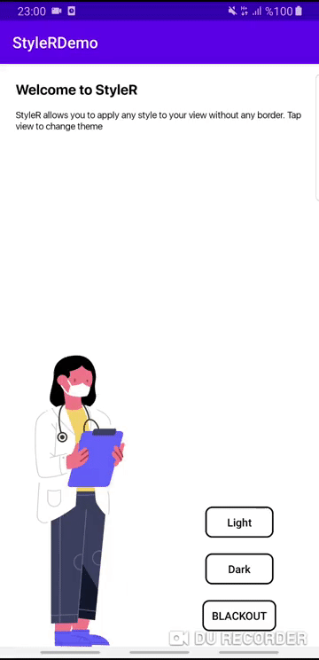

# StyleR

image::https://img.shields.io/badge/version-1.0.0-green.svg[]
image::https://img.shields.io/badge/minSDK-16-yellow.svg[]
image::https://img.shields.io/:license-Apache%202.0-red.svg[]

StyleR allows developer to set view styles programatically. Thus developer can create many style for one view, it allows developer to implement download styles from remote data source and change app style in runtime.

StyleR will save you from coding same view because of little style differences.

Now you can code the view once and use it for different looks. Set different styles to your view with a line of code!

See link:https://github.com/mayuce/StyleR/wiki[Wiki Page] to understand more.

## Styling The Views

Sample app shows how to use StyleR for different app themes (Light, Dark, Blackout) and Styling one view for many view.

* App Theme

You can change app theme without restarting you activity.



* 1 View to Many View

Simply it provides setting view styles programmatically

image::images/styler_sample.gif[200,300]

link:https://github.com/mayuce/StyleR/wiki/Styling-The-Views[See Styling The Views wiki to understand].

## HOW TO ADD YOUR PROJECT

### StyleR Dependencies

StyleR needs three different maps which is provided by your application. These maps are:

* *View StyleR Map*: This is the map which is contains all of your styles. StyleR provides a plugin to merge all of your styles or if you want to download
it from remote source you can provide that value comes from remote server too.
link:https://github.com/mayuce/StyleR/blob/master/app/src/main/res/raw/styler.json[Example]

* *Styles Map*: StyleR has its own style processor. This makes the things easier as Android. Think that you're declaring HeaderTextViewStyle in styles.xml. It works the same way as Android. You can provide it from local or remote as view styler map.
link:https://github.com/mayuce/StyleR/blob/master/app/src/main/res/raw/styles.json[Example]

* *Colors Map*: This works as Androids colors.xml as styles map and you can provide it from local or remote as view styler map too.
link:https://github.com/mayuce/StyleR/blob/master/app/src/main/res/raw/colors.json[Example]

### StyleR Implementation

Add these lines to your project:

Project level link:https://github.com/mayuce/StyleR/blob/master/build.gradle[build.gradle]
```java
allprojects {
    repositories {
        ...
        maven { url 'https://jitpack.io' }
    }
}
```

In your module which you'll apply StyleR (app or if you have components module for example).

App level link:https://github.com/mayuce/StyleR/blob/master/app/build.gradle[build.gradle]
```java
dependecies {
...
implementation 'com.github.mayuce:StyleR:1.0.1'
...
}
```

Then add plugin configurations to same build.gradle file by folloing the below lines.

```java
apply plugin: 'com.labters.styler.stylerplugin'
styleRConfig {
    styleRMerger {
        directories = ["$projectDir/src/main/java/<DIRECTORY PATH COMES HERE FOR EX.>", "You can add more than one directory and it doesn't have to be in project dir."]
        includeSubFolders = true // or false whatever you need
        exportDirectory = "$projectDir/src/main/res/raw" // See StyleR Demo app module to understand this.
    }
}

buildscript {
    repositories {
        gradlePluginPortal()
    }
    dependencies {
        classpath "com.labters.styler.stylerplugin:stylertask:1.0.0"
    }
}
```

Now you are ready to define your styles and make your app less coded and more fancy look from others!

### Initializing The StyleR

To initialize StyleR go to your Application class and call StyleR.initialize function. The code shown below is for calling StyleR from 
local source. If you have download logics in your app you can call it from there or call from room etc.

```kotlin
val type = object : TypeToken<HashMap<String, List<HashMap<String, String>>>>() {}.type
val typeBasic = object : TypeToken<HashMap<String, String>>() {}.type
val typeStyle = object : TypeToken<HashMap<String, HashMap<String, String>>>() {}.type
StyleRProvider.initialize(
 Gson().fromJson(resources.getRawTextFile(R.raw.styler), type),
 Gson().fromJson(resources.getRawTextFile(R.raw.colors), typeBasic),
 Gson().fromJson(resources.getRawTextFile(R.raw.styles), typeStyle)
 ) {
    (view as? CardView)?.setStyleR(hashMap)
    // Call your own created view binders if you have.
 }
```

link:https://github.com/mayuce/StyleR/blob/master/app/src/main/java/com/labters/stylerdemo/styler/AppStyleR.kt[See the example.]
link:https://github.com/mayuce/StyleR/blob/master/app/src/main/java/com/labters/stylerdemo/StyleRApp.kt[See the application class.]

### Applying The StyleR

You can apply StyleR each view of your module. But what I suggest is create your own views under a folder which is shown in
link:https://github.com/mayuce/StyleR/tree/master/app/src/main/java/com/labters/stylerdemo/components/sampleview[*app module*].

Apply StyleR in your BaseView class or apply it by redeclaring the function wherever you want to call as 

StyleR.applyStyle(ROOT VIEW OF GROUP, NAME OF THE VIEW STYLE)

```kotlin
StyleR.applyStyle(binding.root, "${javaClass.simpleName}${AppStatics.appColor.key}")
// THIS MEANS
// StyleR.applyStyle(binding.root, "SimpleView")
// StyleR.applyStyle(binding.root, "SimpleView.Dark")
// StyleR.applyStyle(binding.root, "SimpleView.Blackout")
```

## What Else Can You Add?

StyleR comes with function which is each developer contribute by their own functions for their modules. So what is it?
By StyleR view setter scoped functions you will get the same view & property map which is StyleR has got. So you can apply your own 
styler from there.

link:https://github.com/mayuce/StyleR/blob/master/app/src/main/java/com/labters/stylerdemo/styler/AppStyleR.kt[See the example.]

Please see sample app module to understand how it using or link:https://github.com/mayuce/StyleR/wiki/Attributes[see Attributes wiki].

## StyleR Attributes

link:https://github.com/mayuce/StyleR/wiki/Attributes[See Attributes wiki].


