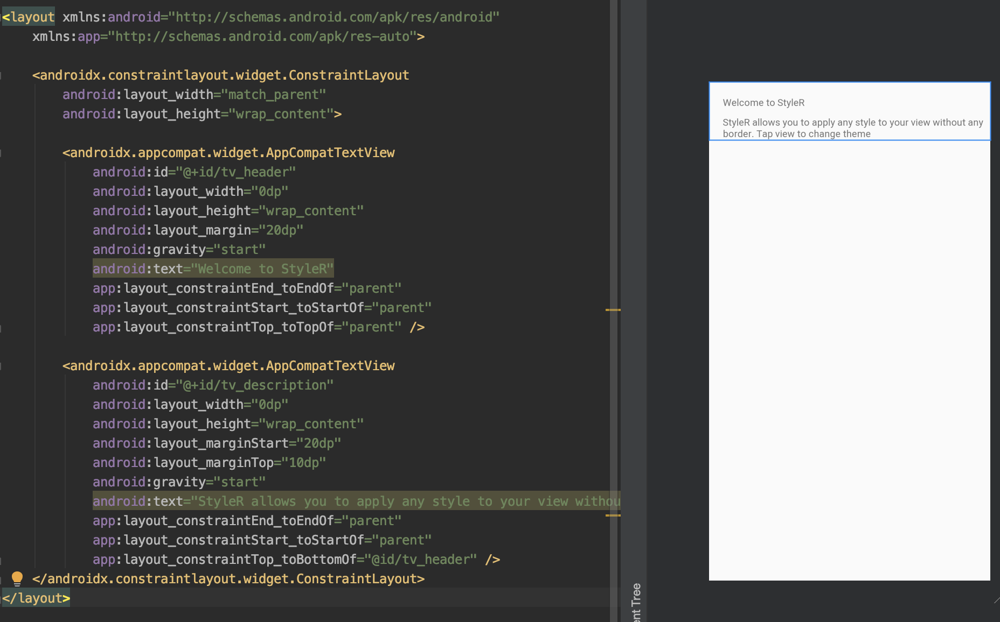

# StyleR

image::https://img.shields.io/badge/version-1.0.0-green.svg[]
image::https://img.shields.io/badge/minSDK-16-yellow.svg[]
image::https://img.shields.io/:license-Apache%202.0-red.svg[]

StyleR provides styling features which is can *changeable in runtime*, *downloadable* from remote & more.
StyleR will save you from coding same view because of little style differences.
Now you can code the view once and use it with different looks. Set different styles to your view with a line of code!

image::images/styler.gif[200,300]

## HOW IT WORKS

StyleR has it's own merger plugin, when you're coding the view you will create *style.json* for the view. This style.json basically looks like:

```bourne
{
  "SampleView": [
    {
      "id": "tv_header",
      "style": "AppText.Header"
    },
    {
      "id": "tv_description",
      "style": "AppText",
      "textSize": 12,
      "textColor": "red"
    },
    {
      "id": "iv_header",
      "elevation": 8
    }
  ]
}
```

First key is the name of style for the view. You can create endless different styles for your view. The value of the key is list of maps.
Each member of this list represents the child views of the parent view group. You must provide each view with its ID and set the properties which is
you would like to add your view by StyleR. Let the StyleR does its job then :)


### Styling

Sample app shows how to use StyleR for different app themes (Light, Dark, Blackout). But you can use StyleR for any purpose. 
For example you can see below view.



This view represents our link:https://github.com/mayuce/StyleR/blob/master/app/src/main/java/com/labters/stylerdemo/components/sampleview/SampleView.kt[SampleView] class layout file. We want to change this view look but to do it we have to manually add the code which sets each of view to how it looks. StyleR comes from here.
You only just calling StyleR with given theme and StyleR does the rest of it.

Here is the SampleView styles:

```bourne
{
  "SampleView": [
    {
      "id": "tv_header",
      "style": "AppText.Header"
    },
    {
      "id": "tv_description",
      "style": "AppText"
    }
  ],
  "SampleView.Reverse": [
    {
      "id": "tv_header",
      "style": "AppText"
    },
    {
      "id": "tv_description",
      "style": "AppText.Header"
    }
  ],
  "SampleView.HugeHeader": [
    {
      "id": "tv_header",
      "style": "AppText.Header",
      "textSize": 60,
      "textColor": "red"
    },
    {
      "id": "tv_description",
      "style": "AppText"
    }
  ]
}
```

And here how it looks each of styles:

*SampleView*


*SampleView.Reverse*


*SampleView.HugeHeader*


And link:https://github.com/mayuce/StyleR/blob/master/app/src/main/java/com/labters/stylerdemo/components/sampleview/SampleView.kt[Here] is how it works from the code


## HOW TO ADD YOUR PROJECT

### StyleR Dependencies

StyleR needs three different maps which is provided by your application. These maps are:

* *View StyleR Map*: This is the map which is contains all of your styles. StyleR provides a plugin to merge all of your styles or if you want to download
it from remote source you can provide that value comes from remote server too.
link:https://github.com/mayuce/StyleR/blob/master/app/src/main/res/raw/styler.json[Example]

* *Styles Map*: StyleR has its own style processor. This makes the things easier as Android. Think that you're declaring HeaderTextViewStyle in styles.xml. It works the same way as Android. You can provide it from local or remote as view styler map.
link:https://github.com/mayuce/StyleR/blob/master/app/src/main/res/raw/styles.json[Example]

* *Colors Map*: This works as Androids colors.xml as styles map and you can provide it from local or remote as view styler map too.
link:https://github.com/mayuce/StyleR/blob/master/app/src/main/res/raw/colors.json[Example]

### StyleR Implementation

First you have to add the lines below in your module which you'll apply StyleR (app or if you have components module for example).

```bourne
dependecies {
...
implementation 'com.labters:styler:1.0.0'
...
}
```

Then add plugin configurations to same build.gradle file by folloing the below lines.

```bourne
apply plugin: 'com.labters.styler.stylerplugin'
styleRConfig {
    styleRMerger {
        directories = ["$projectDir/src/main/java/<DIRECTORY PATH COMES HERE FOR EX.>", "You can add more than one directory and it doesn't have to be in project dir."]
        includeSubFolders = true // or false whatever you need
        exportDirectory = "$projectDir/src/main/res/raw" // See StyleR Demo app module to understand this.
    }
}

buildscript {
    repositories {
        gradlePluginPortal()
    }
    dependencies {
        classpath "com.labters.styler:styler-plugin:1.0.0"
    }
}
```

Now you are ready to define your styles and make your app less coded and more fancy look from others!

### Initializing The StyleR

To initialize StyleR go to your Application class and call StyleR.initialize function. The code shown below is for calling StyleR from 
local source. If you have download logics in your app you can call it from there or call from room etc.

```kotlin
val type = object : TypeToken<HashMap<String, List<HashMap<String, String>>>>() {}.type
val typeBasic = object : TypeToken<HashMap<String, String>>() {}.type
val typeStyle = object : TypeToken<HashMap<String, HashMap<String, String>>>() {}.type
StyleRProvider.initialize(
 Gson().fromJson(resources.getRawTextFile(R.raw.styler), type),
 Gson().fromJson(resources.getRawTextFile(R.raw.colors), typeBasic),
 Gson().fromJson(resources.getRawTextFile(R.raw.styles), typeStyle)
 ) {
    (view as? CardView)?.setStyleR(hashMap)
    // Call your own created view binders if you have.
 }
```

link:https://github.com/mayuce/StyleR/blob/master/app/src/main/java/com/labters/stylerdemo/styler/AppStyleR.kt[See the example.]
link:https://github.com/mayuce/StyleR/blob/master/app/src/main/java/com/labters/stylerdemo/StyleRApp.kt[See the application class.]

### Applying The StyleR

You can apply StyleR each view of your module. But what I suggest is create your own views under a folder which is shown in
link:https://github.com/mayuce/StyleR/tree/master/app/src/main/java/com/labters/stylerdemo/components/sampleview[*app module*].

Apply StyleR in your BaseView class or apply it by redeclaring the function wherever you want to call as 

StyleR.applyStyle(ROOT VIEW OF GROUP, NAME OF THE VIEW STYLE)

```kotlin
StyleR.applyStyle(binding.root, "${javaClass.simpleName}${AppStatics.appColor.key}")
// THIS MEANS
// StyleR.applyStyle(binding.root, "SimpleView")
// StyleR.applyStyle(binding.root, "SimpleView.Dark")
// StyleR.applyStyle(binding.root, "SimpleView.Blackout")
```

### What Can You Add?

StyleR comes with function which is each developer contribute by their own functions for their modules. So what is it?
By StyleR view setter scoped functions you will get the same view & property map which is StyleR has got. So you can apply your own 
styler from there.

link:https://github.com/mayuce/StyleR/blob/master/app/src/main/java/com/labters/stylerdemo/styler/AppStyleR.kt[See the example.]

Please see sample app module to understand how it using.

### StyleR Included Attributes

* Any View:

```bourne
"style": Style name which provides by styles.json
"backgroundColor": View background color from colors.json
"pressedBackgroundColor": View pressed background color from colors.json
"disabledBackgroundColor": View disabled background color from colors.json
"backgroundRadius": View background corner radius in dp
"backgroundBorderWidth": View border width in dp
"elevation": View elevation in dp
```

* Any View extends *Text View* (You can use for buttons too):

```bourne
"style": Style name which provides by styles.json
"textSize": Text size in sp
"fontName": Font name which is under assets folder
"textColor": Text color from colors.json
"disabledTextColor": Disabled text color from colors.json
"pressedTextColor": Pressed text color from colors.json
```

* Button:

```bourne
"style": Style name which provides by styles.json
```

You can add more view binders as shown in the sample app. link:https://github.com/mayuce/StyleR/blob/master/app/src/main/java/com/labters/stylerdemo/styler/CardViewBinder.kt[See the example.]
link:https://github.com/mayuce/StyleR/blob/master/app/src/main/java/com/labters/stylerdemo/styler/AppStyleR.kt[Example usage.]
